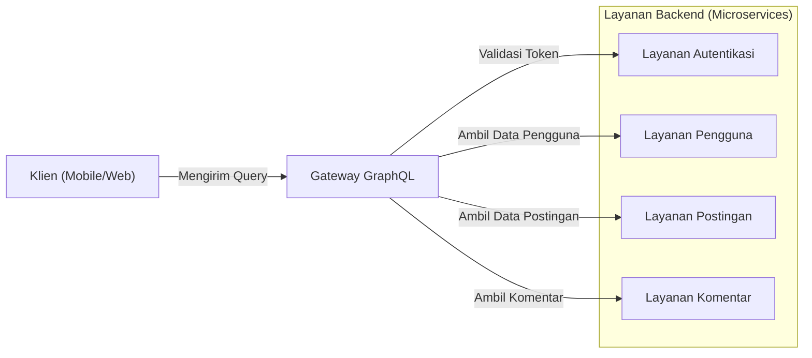

```mermaid
flowchart LR
    Client["Klien (Mobile/Web)"]
    GQL["Gateway GraphQL"]

    subgraph Layanan_Backend ["Layanan Backend (Microservices)"]
        Auth["Layanan Autentikasi"]
        User["Layanan Pengguna"]
        Post["Layanan Postingan"]
        Comment["Layanan Komentar"]
    end

    Client -->|Mengirim Query| GQL
    GQL -->|Validasi Token| Auth
    GQL -->|Ambil Data Pengguna| User
    GQL -->|Ambil Data Postingan| Post
    GQL -->|Ambil Komentar| Comment
```
